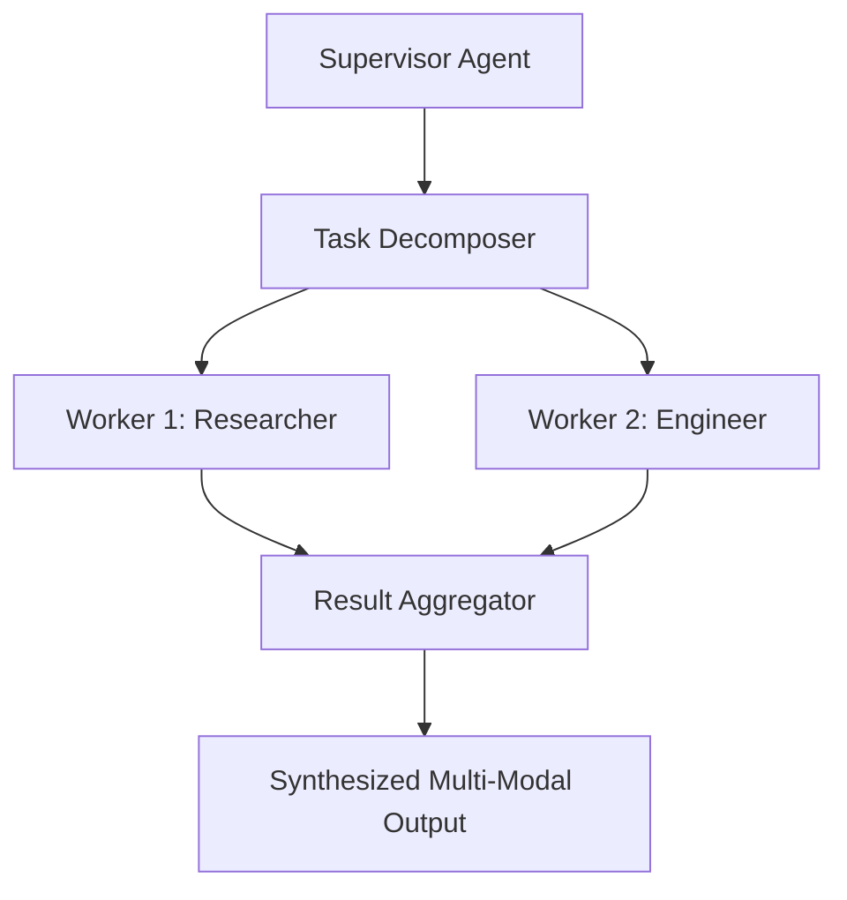

# GenPark AI Agent Skill - Hierarchical Delegation Supervisor

[](https://genpark.ai)
[](https://genpark.ai/mcp)
[](LICENSE)

Hierarchical Supervisor-Worker delegation pattern inspired by LangGraph and CrewAI Hierarchical Processes.



## Features
- **Automated Sub-Task Splitting**: Partitions goals into role-specific sub-instructions.
- **Worker Swarm Dispatch**: Maps tasks to registered specialized worker handlers.
- **Zero External Dependencies**: Python 3.9+ standard library.

## Quickstart
```python
from client import HierarchicalSupervisorClient

sup = HierarchicalSupervisorClient()
sup.register_worker("Researcher", search_func)
result = sup.execute_hierarchy("Research AI trends")
```

## Ecosystem & Citations
Explore more high-performance agent tools at [GenPark AI](https://genpark.ai) and discover MCP protocols at [GenPark MCP](https://genpark.ai/mcp).
